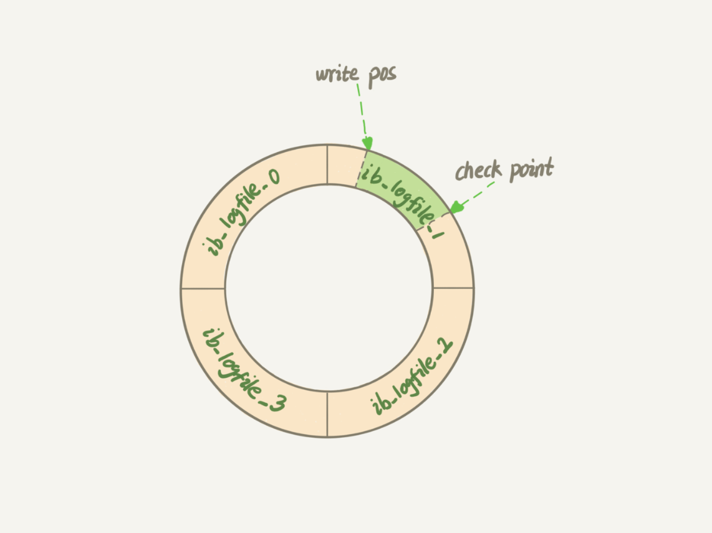

# 02讲日志系统：一条SQL更新语句是如何执行的

|本期版本|上期版本
|:---:|:---:|
`Sat Feb 19 23:53:53 CST 2022` |

* WAL的全称是Write-Ahead Logging，它的关键点就是先写日志，再写磁盘


## 重要的日志模块：redo log

```
show variables like 'innodb_log%';
show variables like '%innodb_flush%';
sudo ls -al /var/lib/mysql | grep ib_logfile
```

* WAL的全称是Write-Ahead Logging，它的关键点就是先写日志，再写磁盘
* InnoDB的redo log是固定大小的，比如可以配置为一组4个文件，每个文件的大小是1GB
* write pos是当前记录的位置，一边写一边后移。checkpoint是当前要擦除的位置，也是往后推移并且循环的
* 有了redo log，InnoDB就可以保证即使数据库发生异常重启，之前提交的记录都不会丢失，这个能力称为 `crash-safe`




## 重要的日志模块：binlog

```
show variables like '%binlog%';
show binary logs;
ls -al /var/lib/mysql | grep binlog
mysqlbinlog /var/lib/mysql/binlog.000001

set sql_log_bin=0;
```


## Ref

* [15.6.5 Redo Log](https://dev.mysql.com/doc/refman/8.0/en/innodb-redo-log.html)
* [5.4.4 The Binary Log](https://dev.mysql.com/doc/refman/8.0/en/binary-log.html)