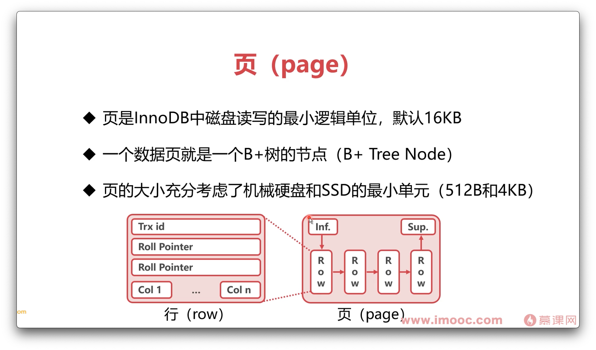

# 4-5 InnoDB数据表是如何存储的


```
show variables like 'datadir';
show variables like 'innodb_file_per_table';
```



 

## Ref

* [datadir](https://dev.mysql.com/doc/refman/8.0/en/server-system-variables.html#sysvar_datadir)
* [innodb_file_per_table](https://dev.mysql.com/doc/refman/8.0/en/innodb-parameters.html#sysvar_innodb_file_per_table)
* [15.6.3.2 File-Per-Table Tablespaces](https://dev.mysql.com/doc/refman/8.0/en/innodb-file-per-table-tablespaces.html)