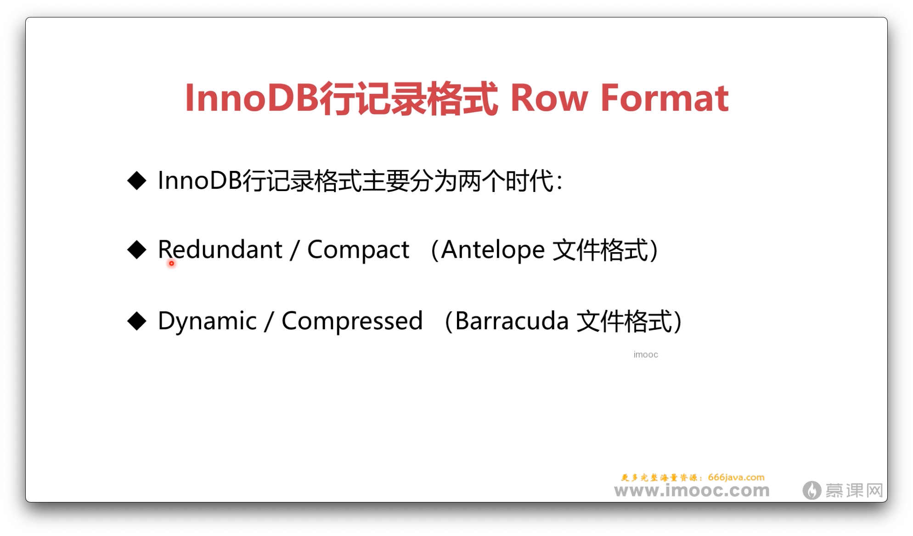

# 4-7 InnoDB数据行长什么样-2

## Ref

* [InnoDB的行记录格式, Compact, Redundant, Compressed, Dynamic](https://www.cnblogs.com/wade-luffy/p/6289183.html)
* [MySQL · 周边工具 · MySQL InnoDB inno_space 工具介绍](http://mysql.taobao.org/monthly/2021/11/02/)
* [什么？还在用delete删除数据《死磕MySQL系列 九》](https://www.cnblogs.com/fkaka/p/15544445.html)
* [https://github.com/happieme/py_innodb_page_info](https://github.com/happieme/py_innodb_page_info)
* [MySQL工具之innodb_ruby：探究InnoDB存储结构的利器](https://www.modb.pro/db/172853)
* [深入理解mysql----innodb_ruby工具](https://juejin.cn/post/6844903844107780103)
* [一种探究 InnoDB 的存储格式的新方式](https://heapdump.cn/article/2384843)

## innodb_ruby

* [https://github.com/jeremycole/innodb_ruby](https://github.com/jeremycole/innodb_ruby)

## 表空间

* [MySQL的表空间是什么](https://www.cnblogs.com/better-farther-world2099/articles/14713523.html)
* [MySQL（九）：InnoDB 表空间（Tables）](https://blog.csdn.net/u010647035/article/details/105009979)

